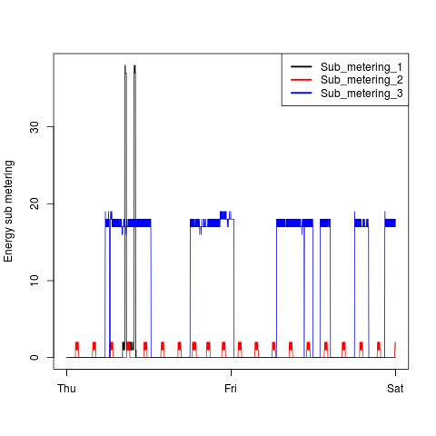
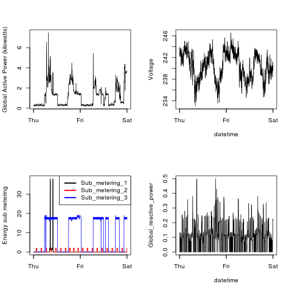

## Introduction

* <b>Description</b>: Project One for Exploratory Data Analysis.
Includes 4 png files and the 4 R source codes to create each graph.

The four plots are shown below. 

### Plot 1

 

### Plot 2

 

### Plot 3

 

### Plot 4

 

